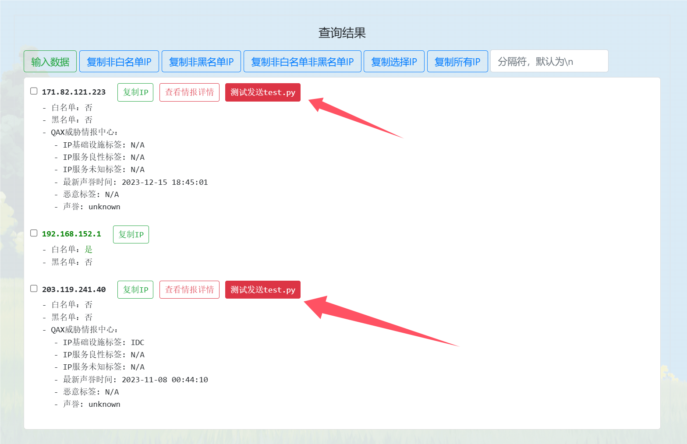
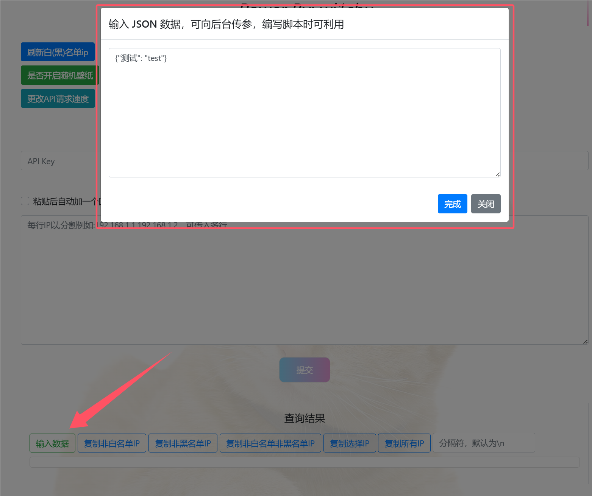
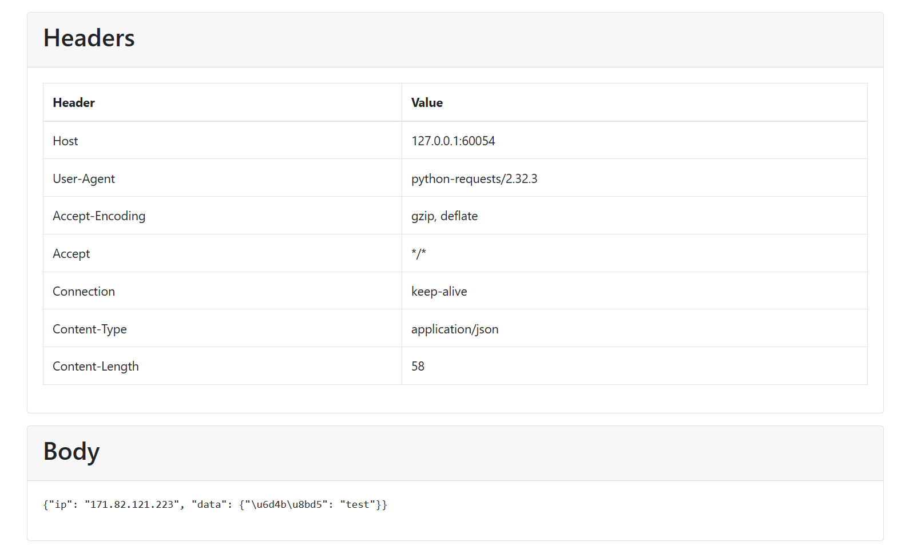
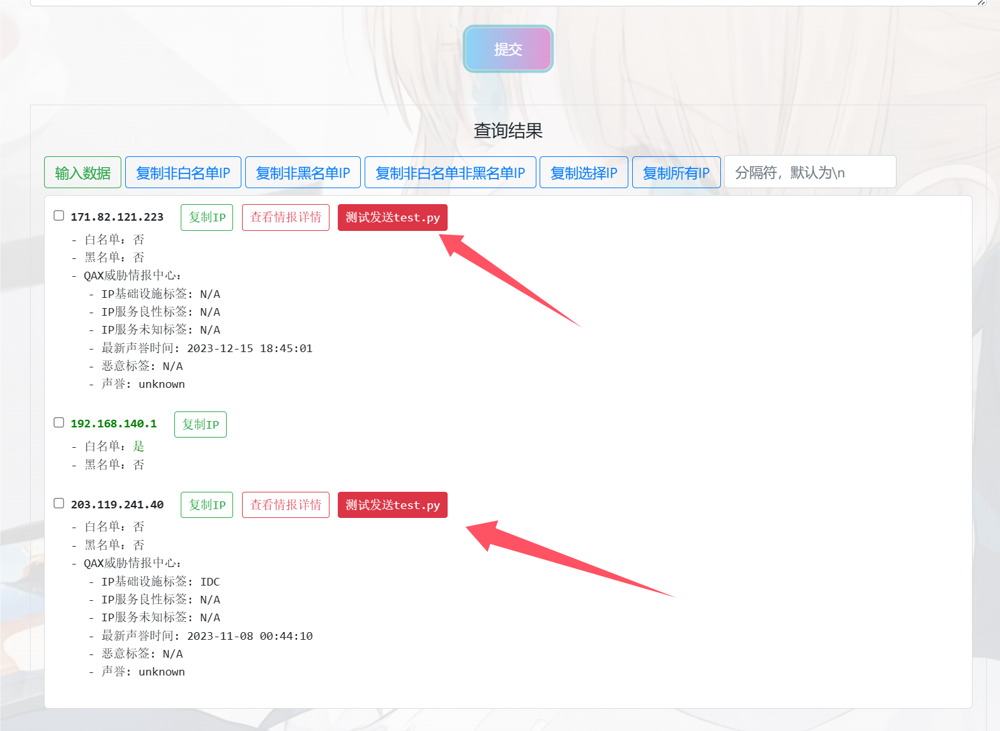

## 背景

值守客户这边封禁ip需要在多个防火墙上进行封禁，并且存在各种各样的白名单、黑名单，于是编写了这个工具用于快速检索ip和封禁。


## 使用

### 基本用法

开发环境 Python 3.9

1. 安装所需库`pip install -r requirements.txt`
2. 启动工具`python app.py`
3. 访问 http://127.0.0.1:60053 即可

输入查询ip时，可输入多行，每行可输入多个ip，每个ip之间用`,`分割，示例：

```
192.168.0.1,192.168.0.2
10.1.2.3
```

白名单请放置 `工具目录/data/white`下  ，黑名单请放置`工具目录/data/black`下，具体格式请自行到相应文件夹查看。

如果在运行过程中修改了白名单/黑名单，请点击页面上的 <u>*刷新白(黑)名单ip*</u> 按钮进行更新。

可对接奇安信威胁情报API，填入对应key即进行查询，可选，可调节并发速率，防止查询过快导致结果缺失。

如果查询的ip不为白名单，会进行威胁情报查询，并且会展示出对接的其他平台的按钮。



### 自行编写脚本用法

可编写脚本放置于 **bullets** 目录下，该目录下的`BaseClass.py`中的`_BaseRequestClass`类为模板类，编写脚本时请继承该类并放置于 **bullets** 目录。

#### `_BaseRequestClass`类：

该类的`name`属性为展示到前端的名称，`request`方法为点击按钮时执行的方法。

`request`方法的参数`ip`为对应的ip，`data`为前端设置的数据，可点击前端的 <u>*输入数据*</u> 按钮进行设置，需为JSON格式（需求背景：发送封禁请求到对应平台需要设置cookie，多个平台有多个cookie，频繁修改脚本并重启很麻烦）





方法返回数据说明

```json
{
    "status": 0或者1,1代表请求成功，0代表失败,
    "message": 在前端展示的信息,
    "error": 如果发送失败，在前端展示的信息,
    "data": 需要往前端发送的数据
}
```

示例脚本：`bullets/test.py` ，请自行查看。

可启动 `test_app.py` 后，点击 <u>*测试发送test.py*</u> 按钮，然后访问  http://127.0.0.1:60054 查看发送的请求。



